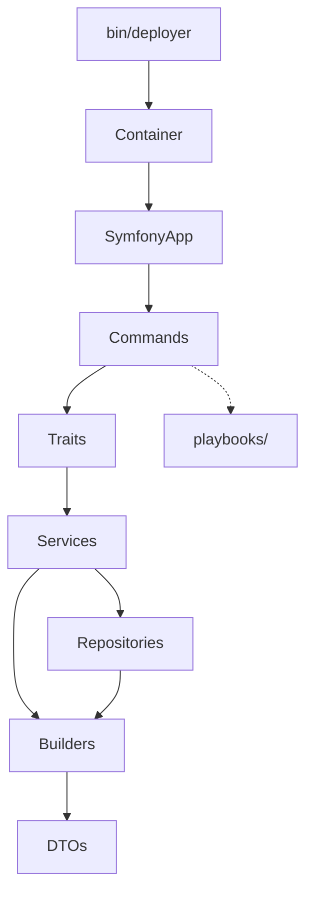

# DeployerPHP

DeployerPHP is a Symfony Console Composer package (`loadinglucian/deployer-php`)
for provisioning, installing, and deploying servers and sites.

> **IMPORTANT**
>
> - All object creation goes through `Container` (except DTOs/Builders)
> - DTOs are ALWAYS created via Builders, never directly with `new *DTO()`
> - Services throw complete, user-facing exceptions; Commands display them
>   without prefixes
>
> Keep this file lean and always-on. Put deep domain procedures in project
> skills under `.agents/skills/`.

## Context

### Architecture

Update and maintain this Architecture section when the system changes.



```text
app/
├── Builders/          # DTO factory classes (centralized instantiation)
├── Console/           # Commands
│   ├── Cloud/         # AWS/Cloudflare/DigitalOcean command domains
│   ├── Cron/
│   ├── Mariadb/
│   ├── Memcached/
│   ├── Nginx/
│   ├── Php/
│   ├── Postgresql/
│   ├── Redis/
│   ├── Scaffold/
│   ├── Server/
│   ├── Site/
│   └── Supervisor/
├── Services/          # Business logic and provider integrations
├── Repositories/      # Inventory access
├── DTOs/              # Immutable readonly data objects
├── Traits/            # Shared command behavior
├── Contracts/         # BaseCommand
├── Enums/             # Domain enums (distribution, WWW mode, etc.)
├── Exceptions/        # Custom exceptions
├── Container.php      # DI auto-wiring
└── SymfonyApp.php     # CLI registration
playbooks/             # Remote bash scripts
tests/bats/            # VM + cloud integration tests
```

| Layer        | Purpose                         | I/O         |
| ------------ | ------------------------------- | ----------- |
| Commands     | Orchestrate user interaction    | Yes         |
| Traits       | Shared command operations       | Via Command |
| Services     | Business logic, external APIs   | No          |
| Repositories | Inventory CRUD                  | No          |
| Builders     | Centralized DTO instantiation   | No          |
| DTOs         | Immutable readonly data objects | No          |
| playbooks/   | Remote server provisioning      | Via SSH     |

### Key Runtime Contracts

**Install credentials:**

- `mariadb:install`, `postgresql:install`, and `redis:install` support
  `--display-credentials` and `--save-credentials`.
- BATS credential-auth checks for install commands run from server localhost
  context via SSH.
- `memcached:install` has no credential output flow.

**Playbook/test contracts:**

- Playbooks do not consume `DEPLOYER_DISTRO`; distro validation is centralized
  in `ServersTrait::getServerInfo()` and cloud image selection.
- VM distro/port mapping is centralized in `tests/bats/lib/vm-matrix.bash`.
- Cloud test naming/cleanup contracts are centralized in
  `tests/bats/lib/cloud-helpers.bash` and `tests/bats/lib/cloud-janitor.sh`.
- Cloud tests use stable run-suffix naming (`r<suffix>` and `r<suffix>.v2`),
  and do not create/validate `www.*` records.

**Server info validation:**

- `getServerInfo()` runs `server-info.sh` via SSH and validates Ubuntu,
  version (LTS 24.04+), and permissions.
- Skip info validation only for commands that do not depend on playbooks/server
  state:
    - `server:ssh`
    - `server:run`
    - `site:ssh`
    - `site:dns:check`

**Site WWW behavior:**

- `site:create` auto-detects subdomains with `DomainOperationsTrait::isSubdomain()` and
  forces `www_mode=none`.
- For subdomains, only `--www-mode=none` is valid; other values are ignored
  with a warning.
- Site inventory persists `www_mode` and `has_www`; commands must use
  `SiteDTO::$hasWww` instead of assuming `www.<domain>` exists.
- Canonical WWW mode values are centralized in `Enums\WwwMode`.

**DNS check behavior:**

- `site:dns:check` wraps Google DNS lookups in `RetryService`.
- It checks `www.<domain>` only when `SiteDTO::$hasWww` is true.

## Skills

Use these project-local skills for deep procedural guidance.

| Domain          | Skill                            | Path                                                     |
| --------------- | -------------------------------- | -------------------------------------------------------- |
| Commands/Traits | `deployerphp-command-authoring`  | `.agents/skills/deployerphp-command-authoring/SKILL.md`  |
| Playbooks       | `deployerphp-playbook-authoring` | `.agents/skills/deployerphp-playbook-authoring/SKILL.md` |
| BATS            | `deployerphp-bats-testing`       | `.agents/skills/deployerphp-bats-testing/SKILL.md`       |
| GitHub Actions  | `deployerphp-gha-ci`             | `.agents/skills/deployerphp-gha-ci/SKILL.md`             |
| Documentation   | `deployerphp-docs-policy`        | `.agents/skills/deployerphp-docs-policy/SKILL.md`        |

### Skill Loading Rule

- If a task touches one of the domains above, load the matching skill first.
- Read only the needed reference files from that skill.
- Do not duplicate large rule blocks from skills back into `AGENTS.md`.

## Standards

- Use `$container->build(ClassName::class)` for object creation (except
  DTOs/Builders).
- Instantiate DTOs through builders (`::new()`, `::from()`, `::fromStorage()`).
- Services throw complete user-facing exceptions with context.
- Commands display exception messages directly (no prefixed wrappers).
- Preserve exception chains with `previous: $e`.

## Constraints

- Never instantiate DTOs directly with `new *DTO()`.
- Never bypass `Container` for object creation (except DTOs/Builders).
- Never add prefixes when printing service exception messages in commands.
- Never wrap exceptions without `previous: $e`.
